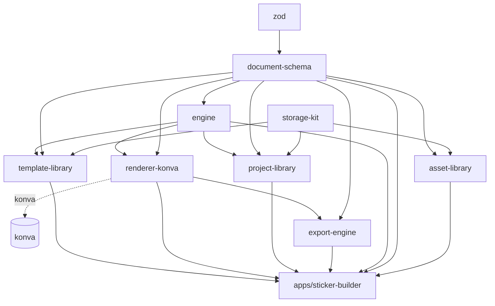

# Impulso Platform — Arquitectura

> **Estado: refleja el código real del monorepo**, actualizado en Epic 6 (Platform Consolidation). Reemplaza la versión anterior ("Fase 0, v3"), que era un documento de diseño escrito antes de que existiera código y describía varias decisiones tecnológicas concretas (React, react-konva, Zustand, Tailwind, Radix UI) que nunca se implementaron — conservada como registro histórico en [`archive/ARCHITECTURE-phase0-original-design.md`](archive/ARCHITECTURE-phase0-original-design.md). Los principios estructurales de fondo de ese documento (Document Schema → Engine → Renderer, núcleo sin dependencia de render) sí se mantuvieron y se verifican activamente — este documento describe cómo se ven hoy, en código real.
>
> Para la narrativa de POR QUÉ cada pieza se construyó así, ver los [ADRs](adr/) (uno por Foundation/Epic) y su [índice de lectura rápida](product/06-Architecture-Decisions.md). Para el mapa de PRODUCTO (qué existe vs. qué está planeado, sin detalle técnico) ver [`product/03-Architecture-Map.md`](product/03-Architecture-Map.md) — este documento es su compañero técnico, no un duplicado.

---

## 1. Los tres niveles del núcleo (Impulso Engine)

```
Document Schema   →   Engine   →   Renderer (adaptador)   →   Konva (hoy)
   (datos puros)      (lógica)        (traductor visual)        (librería concreta)
```

- **`packages/document-schema`** — la única fuente de verdad de un proyecto (`Project → Document → Page → Layer → SceneObject`). Zod + TypeScript puro. **Cero dependencias** más allá de `zod` — sin DOM, sin render, sin ninguna otra librería propia de Impulso.
- **`packages/engine`** — opera exclusivamente sobre el Document Schema: comandos (`dispatch`, nunca lanza — devuelve `EngineResult`), estado, undo/redo (snapshots completos), selección (efímera, no versionada), eventos (pub-sub propio). Depende únicamente de `document-schema` + `zod`. **No tiene a Konva como dependencia** — verificado, no solo declarado (`madge --circular` + inspección de `package.json` en cada build).
- **`packages/renderer-konva`** — implementación concreta del contrato `RendererAdapter { mount, destroy, getStage }`. Traduce el Document Schema a un árbol de nodos Konva reales, y gestos de puntero de vuelta en `engine.dispatch(...)`. Es el **único** paquete de la plataforma con Konva como dependencia.

Esta separación es la que hace posible todo lo demás: cualquier pilar o módulo nuevo puede depender de `document-schema`/`engine` sin arrastrar Konva, y un renderer alternativo (Pixi, SVG-only, headless) reemplazaría `renderer-konva` sin tocar `engine` ni invalidar proyectos guardados.

## 2. Los pilares de plataforma (sobre el núcleo)

Cinco paquetes más, cada uno un pilar reutilizable por cualquier módulo futuro — no exclusivos de Sticker Builder:

| Pilar | Paquete | Qué resuelve | Depende de |
|---|---|---|---|
| **Asset Library** | `packages/asset-library` | Almacenamiento de binarios de Asset (imágenes hoy; el modelo admite más tipos) — IndexedDB + memoria | `document-schema`, `storage-kit` |
| **Export Engine** | `packages/export-engine` | Produce archivos finales (PNG/SVG) a partir del Document Schema. SVG lee el Document Schema directamente (nunca Konva); PNG rasteriza vía un `Konva.Stage` headless (`renderer-konva`), nunca el Stage interactivo del editor | `document-schema`, `renderer-konva` |
| **Templates** | `packages/template-library` | Catálogo de puntos de partida para crear un proyecto — un Template ES un `Project` completo + metadatos de catálogo | `document-schema`, `engine`, `storage-kit` |
| **Project Library** | `packages/project-library` | Administra múltiples proyectos guardados (la Workspace) — un `Project` ya es su propio descriptor de catálogo | `document-schema`, `engine`, `storage-kit` |
| **Storage Kit** | `packages/storage-kit` | Andamiaje genérico de IndexedDB (no un pilar de producto — infraestructura interna compartida por los tres paneles de arriba que usan IndexedDB) | *(ninguna)* |

**Shared Services, Design System y AI Engine** siguen siendo conceptuales — nombrados en el mapa de producto, sin código real todavía (ver [`product/05-Technical-Debt.md`](product/05-Technical-Debt.md)).

## 3. Diagrama de dependencias (real, verificado con `madge --circular`)



Ninguna flecha va "hacia arriba": ni `document-schema` ni `engine` conocen la existencia de ningún pilar ni de la app. `apps/sticker-builder` es el único consumidor de los siete paquetes — un segundo módulo futuro sería otro nodo hoja igual de ancho, nunca insertado entre medio.

## 4. Estructura real del monorepo

```
impulso-builder-platform/
├── packages/
│   ├── document-schema/    # tipos + validación + serialización + migraciones (Zod)
│   ├── engine/              # comandos + estado + historial + eventos + clonado
│   ├── renderer-konva/      # único paquete con Konva; adaptador + rasterización headless
│   ├── storage-kit/         # andamiaje genérico de IndexedDB (openIndexedDb/runInTransaction/...)
│   ├── asset-library/       # AssetBinaryStore (IndexedDB + memoria) + ingesta de imágenes
│   ├── template-library/    # TemplateStore + instantiateTemplate
│   ├── project-library/     # ProjectStore + duplicateProject
│   └── export-engine/       # exportProject (PNG/SVG) + adaptador de descarga en navegador
├── apps/
│   └── sticker-builder/     # el único módulo construido — compone los 7 paquetes de arriba
│       └── src/
│           ├── shell.ts               # orquestador Workspace ↔ Editor (Epic 5)
│           ├── workspace.ts           # pantalla "Mis proyectos"
│           ├── app.ts                 # orquestador del editor
│           ├── bootstrap.ts           # mountCanvasRuntime — primera integración end-to-end
│           ├── newProjectDialog.ts    # galería de Templates ("Nuevo proyecto")
│           ├── saveAsTemplateDialog.ts
│           ├── exportDialog.ts
│           ├── assetsPanel.ts / layersPanel.ts / inspector.ts / tools.ts / zoom.ts / keyboardShortcuts.ts
│           └── workspaceMigration.ts / legacyMigration.ts   # migraciones transparentes de una sola vez
├── docs/
│   ├── ARCHITECTURE.md          # este documento
│   ├── ENGINEERING_STANDARDS.md # estándar de calidad permanente por paquete
│   ├── PERFORMANCE_BUDGET.md    # registro de decisiones con impacto de rendimiento
│   ├── adr/                     # Architecture Decision Records, uno por Foundation/Epic
│   ├── ux-audits/               # UX Audits independientes por bloque funcional (desde Epic 5)
│   ├── platform/                # STATE_00N.md — auditorías de consolidación (desde Epic 6)
│   ├── product/                 # visión, principios, mapa de arquitectura de producto, roadmap, backlogs
│   └── archive/                 # documentos de diseño superados, conservados por valor histórico
├── turbo.json
└── pnpm-workspace.yaml
```

No existen (todavía) `packages/ui`, `packages/config` ni una carpeta `plugin/` dentro de la app — mencionados en el diseño original de Fase 0 pero nunca construidos porque no hay, hasta hoy, un segundo módulo real que los justifique (ver "Simplicidad" en [`product/02-Product-Principles.md`](product/02-Product-Principles.md)).

## 5. Tecnologías realmente usadas hoy

- **TypeScript plano**, sin framework de UI (ni React ni ningún otro) — `apps/sticker-builder` manipula el DOM directamente. Se evaluó implícitamente por "no hay todavía ningún Toolbar/Sidebar que justifique un framework" (ver ADR-0005) y esa condición nunca cambió.
- **Konva** (sin `react-konva`) — un único paquete (`renderer-konva`) lo importa.
- **Vite** — build/dev server de `apps/sticker-builder`; `tsup` para el build de cada paquete de librería.
- **Zod** — validación/tipos en `document-schema`; único dependency externo de todo el núcleo.
- **IndexedDB nativo** (sin la librería `idb`) detrás de `storage-kit` — Asset/Template/Project Library la usan.
- **Vitest** (unit, todos los paquetes) + **Playwright** (verificación en navegador real, por épica) + **`fake-indexeddb`** (para testear los adaptadores IndexedDB reales sin un navegador).
- **Turborepo + pnpm workspaces** — orquestación del monorepo.
- **Sin backend, sin auth, sin infraestructura distribuida** — 100% cliente, persistencia 100% local (IndexedDB), tal como se decidió desde Fase 0 y nunca se revirtió.

Zustand, Immer, Tailwind, Radix UI, React, `idb`, imagetracerjs, js-angusj-clipper y pdf-lib — todos mencionados en el diseño original de Fase 0 — **no forman parte del código real** a la fecha de este documento.

## 6. El contrato `RendererAdapter` (real, no un boceto)

```ts
interface RendererAdapter {
  mount(container: HTMLDivElement): void;
  destroy(): void;
  getStage(): Konva.Stage | null; // acceso de solo lectura al Stage real — este paquete ES el adaptador Konva
}
```

`createKonvaRenderer(engine, options): RendererAdapter` es la única implementación. El Engine llama a los comandos correspondientes cuando el usuario interactúa (vía el `NodeContext` que cada nodo recibe); el Renderer nunca muta el `Project` por su cuenta — todo pasa por `engine.dispatch(...)`, centralizando validación e historial en un solo lugar sin importar qué Renderer esté conectado.

## 7. Por qué la exportación casi nunca necesita al Renderer (verificado, no solo diseñado)

- **SVG** se genera en `export-engine/src/svg/` leyendo el Document Schema directamente — cero import de Konva en ese módulo (verificado por inspección; ver ADR-0012).
- **PNG** es la única excepción real: `konvaPngRasterizer` construye un `Konva.Stage` headless (`renderPageToStage`, en `renderer-konva`) — nunca el Stage interactivo del editor, sin selección/handles/overlays. La dependencia de Konva queda acotada y documentada exclusivamente en el adaptador PNG (`png/` de `export-engine`), tras la aprobación formal de esta decisión (ver ADR-0012, condiciones de aprobación).

## 8. Qué sigue quedando fuera de alcance (ver `product/05-Technical-Debt.md` para el detalle completo)

PDF print-ready con línea de corte/sangrado, autosave, cuentas/auth, sincronización remota, colaboración en tiempo real, marketplace, un segundo módulo real, arquitectura de plugins abierta a terceros — todos deliberadamente diferidos hasta que exista una necesidad de negocio concreta, no por limitación técnica. Ver [`product/PRODUCT_BACKLOG.md`](product/PRODUCT_BACKLOG.md) para estas capacidades evaluadas con valor/prioridad/dependencias/complejidad, y [`WHAT_SHOULD_WE_BUILD_NEXT.md`](../WHAT_SHOULD_WE_BUILD_NEXT.md) para la recomendación de la próxima épica.
