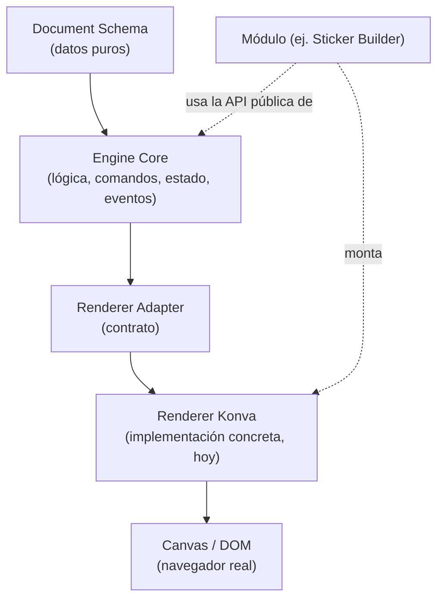

# 03 — Architecture Map

> Cómo está organizada toda **Impulso Platform**, en capas. Este documento describe la estructura conceptual de PRODUCTO — qué existe, qué está planeado, y cómo se relaciona todo. Para el razonamiento técnico de por qué se decidió así, ver [ADR-0001](../adr/0001-impulso-engine-architecture.md) y [`../ARCHITECTURE.md`](../ARCHITECTURE.md). Para el detalle de implementación de cada pieza ya construida, ver el README de su paquete.
>
> **Nota de honestidad:** de todo lo descrito aquí, hoy existe código real para **Impulso Engine** (Document Schema, Engine Core, Renderer Adapter), **Asset Library**, **Export Engine**, **Templates**, **Project Library**, **Print Engine** (completo — Epic 9 cerrada, Fases 9.1-9.5, ver ADR-0021 a ADR-0025) y el módulo **Sticker Builder**. **Commercial Platform** tiene arquitectura/modelo completos (Fase 4.1, ADR-0026 a ADR-0029) y desde Fase 4.2 un primer producto comercial real y vendible: `packages/commercial-schema` + `packages/capabilities` (implementación real de `CapabilityProvider`), conectados al manifest checked-in de `apps/sticker-builder` (`commercial-product.json`, `licensingMode: "delivery-only"`), más un pipeline de empaquetado real (`pnpm build:commercial`) que produce un `.zip` reproducible con checksum. Entitlements/licensing técnico/canales de comercio automatizados/cuentas siguen sin implementación (V1 es deliberadamente manual/offline). Shared Services, Design System, AI Engine y el resto de los Modules son la estructura conceptual hacia la que la plataforma crece — no paquetes ya construidos. Ver [`05-Technical-Debt.md`](05-Technical-Debt.md) para el detalle de qué falta de cada uno.

---

## El mapa completo

```
Impulso Platform
│
├── Impulso Engine        (✅ construido — el núcleo: Document Schema, Engine Core, Renderer Adapter)
│
├── Shared Services         (⏳ planeado — servicios transversales a todos los módulos)
│
├── Design System           (⏳ planeado — UI/componentes compartidos entre módulos)
│
├── AI Engine                (⏳ planeado — capacidades de IA, AI Provider Agnostic)
│
├── Asset Library             (✅ construido — Epic 2, ver ADR-0011; hoy solo imágenes, arquitectura lista para más tipos)
│
├── Export Engine              (✅ construido — Epic 3, ver ADR-0012; PNG/SVG v1, PDF/print-ready planeado)
│
├── Templates                   (✅ construido — Epic 4, ver ADR-0013; único punto de entrada para crear proyectos nuevos)
│
├── Project Library             (✅ construido — Epic 5, ver ADR-0014; Workspace, administración de múltiples proyectos)
│
├── Print Engine                (✅ construido — Epic 9 completa y cerrada, Fases 9.1-9.5, ver ADR-0021 a ADR-0025; PrintJob/boxes físicas/Preflight (44 códigos)/raster PDF-PNG aplanado/marcas de corte/safe area/cut paths/imposición, con wizard real de 7 pasos en Sticker Builder, endurecido con golden tests/performance/accesibilidad/cross-browser documentado)
│
├── Commercial Platform          (✅ primer producto real — Fase 4.1 (ADR-0026 a ADR-0029) diseñó boundaries Module/Feature/Commercial Product/Entitlement/License/Channel; Fase 4.2 conectó eso a "Impulso Sticker Builder Professional" vendible vía Gumroad: `packages/commercial-schema` + `packages/capabilities` + manifest real + `pnpm build:commercial`; capa ortogonal a los pilares creativos de arriba — nunca insertada entre ellos y un Module; entitlements/licensing técnico/cuentas siguen sin código, V1 es delivery-only)
│
└── Modules                     (consumidores de todo lo anterior)
      ├── Sticker Builder          ✅ construido (Foundations 1-3, Editor 1-3, Editor Epic 1, Milestone 1 Alpha)
      ├── Planner Builder          ⏳ planeado
      ├── Coloring Book Builder    ⏳ planeado
      ├── Flashcard Builder        ⏳ planeado
      ├── Worksheet Builder        ⏳ planeado
      ├── Journal Builder          ⏳ planeado
      ├── Bundle Builder           ⏳ planeado
      └── futuros módulos          ⏳ sin definir todavía
```

**Sobre la forma de este árbol:** Impulso Engine, Shared Services, Design System, AI Engine, Asset Library, Export Engine, Templates y Project Library son **pilares hermanos** de la plataforma — cada uno una capacidad transversal que cualquier Module puede consumir. Los Modules, a su vez, también son **hermanos entre sí**: Sticker Builder, Planner Builder, Coloring Book Builder y el resto **no dependen unos de otros** — cada uno consume los pilares de la plataforma de forma independiente. La plataforma crece agregando pilares y módulos en paralelo, nunca encadenando uno sobre otro.

## Vista por capas técnicas (dentro del pilar "Impulso Engine")

Esta es la única parte del mapa con implementación real hoy — el detalle ya documentado en `03-Architecture-Map.md` de versiones anteriores de este documento, sin cambios técnicos:



## Responsabilidades de cada pilar

### Impulso Engine (✅ construido) — el núcleo

Se divide, a su vez, en tres piezas con dependencia estrictamente en una sola dirección — ninguna capa conoce a la que está después de ella:

| Capa | Paquete | Responsabilidad | Lo que NO hace |
|---|---|---|---|
| **Document Schema** | `packages/document-schema` | La única fuente de verdad de un proyecto: tipos (`Project → Document → Page → Layer → SceneObject`) + validación (Zod) + versionado/migraciones. Es literalmente lo que se guarda en disco o `localStorage`, y lo que viaja entre el Engine y cualquier Renderer. | No sabe dibujar nada. Cero dependencias de render, React, Canvas o DOM. |
| **Engine Core** | `packages/engine` | Opera exclusivamente sobre el Document Schema: comandos (agregar/mover/redimensionar/rotar/etc.), estado, undo/redo, selección (efímera), eventos. Toda la lógica de "qué le puedo hacer a un documento" vive aquí — incluida la matemática de resize/rotación. | No sabe dibujar nada, no conoce Konva ni ninguna librería de render, no sabe qué es un "sticker" ni una "línea de corte". |
| **Renderer Adapter** | `packages/renderer-konva` (primera implementación) | Traduce el Document Schema (vía Engine) a un árbol de nodos Konva reales, y traduce gestos de puntero (click, arrastre, handles) de vuelta en llamadas a `engine.dispatch(...)`. Es un adaptador reemplazable. | No decide ninguna regla de negocio: no valida, no versiona, no sabe qué pasa si un comando es inválido más allá de reflejarlo visualmente. |

### Shared Services (⏳ planeado)

Servicios transversales que cualquier Module necesitaría sin reimplementarlos cada vez — por ejemplo, autenticación (cuando exista), persistencia remota, telemetría/analytics, feature flags, internacionalización. Hoy, lo único parecido a esto es la persistencia local de Sticker Builder (`apps/sticker-builder/src/persistence.ts`, ver ADR-0009) — construida como código de aplicación, no todavía como un servicio compartido de plataforma. Se convierte en un pilar real cuando exista un segundo módulo que también lo necesite (ver ADR-0009, "Compatibilidad futura").

### Design System (⏳ planeado)

Componentes de UI (botones, paneles, inputs, iconografía, tokens de color/tipografía) compartidos entre todos los Modules, para que cada uno no reconstruya su propia Toolbar/Sidebar desde cero ni con una identidad visual distinta. `ARCHITECTURE.md` ya anticipaba un paquete `packages/ui` con este propósito — no construido todavía porque Sticker Builder, en su etapa Alpha, no tiene todavía una interfaz de edición con diseño real que lo justifique (ver Milestone 1, "Riesgos y limitaciones conocidas").

### AI Engine (⏳ planeado)

Cualquier capacidad de inteligencia artificial de la plataforma (generación de imágenes, sugerencias de diseño, autocompletado, etc.), diseñada desde el principio para ser **AI Provider Agnostic** (ver [`02-Product-Principles.md`](02-Product-Principles.md)) — un contrato/adaptador propio, análogo a `RendererAdapter`, en vez de un acoplamiento directo a un proveedor específico. Hoy no existe ninguna funcionalidad de IA en la plataforma; este pilar documenta la intención de cómo se construiría cuando llegue el momento, no una implementación en curso.

### Asset Library (✅ construido — Epic 2)

`packages/asset-library`: almacenamiento de binarios (`AssetBinaryStore`, IndexedDB) + ingesta por tipo, genérico sobre cualquier tipo de Asset del Document Schema (`Document.assets`). V1 implementa solo `image` (PNG/SVG); el modelo/organización/API ya admiten fuentes, plantillas, íconos, patrones, fondos, texturas, marcos, mockups o assets de IA sin rediseño. Ver [ADR-0011](../adr/0011-asset-library.md).

### Export Engine (✅ construido — Epic 3)

`packages/export-engine`: produce archivos finales (PNG/SVG v1) a partir del Document Schema, reutilizable por cualquier módulo. SVG es independiente de Konva (lee el Document Schema directamente, tal como anticipaba `../ARCHITECTURE.md` §2.5); PNG reutiliza `@impulso/renderer-konva` vía un Stage headless, nunca el Stage interactivo del editor. PDF print-ready con línea de corte/sangrado queda para una épica futura — ver [ADR-0012](../adr/0012-export-engine.md).

### Templates (✅ construido — Epic 4)

`packages/template-library`: catálogo de plataforma de puntos de partida para crear un proyecto nuevo, reutilizable por cualquier módulo. Un Template es un `Project` completo (Document Schema, sin cambios) envuelto en metadatos de catálogo (`TemplateDescriptor`, liviano y siempre listable) — el contenido pesado (`TemplateContent`: el `Project` + una miniatura opaca) se carga bajo demanda. Depende únicamente de `@impulso/document-schema` y `@impulso/engine` — nunca de `@impulso/export-engine` ni de Konva; la generación de miniaturas vive exclusivamente en código de aplicación. Es, desde esta épica, el único punto de entrada para crear un proyecto nuevo en Sticker Builder — reemplaza por completo el concepto anterior de "preset" específico de un módulo. Ver [ADR-0013](../adr/0013-templates-foundation.md).

### Project Library (✅ construido — Epic 5)

`packages/project-library`: administra múltiples proyectos guardados — la base de la pantalla "Mis proyectos" (Workspace), reutilizable por cualquier módulo. A diferencia de un Template, un `Project` ya es su propio descriptor de catálogo (`id`/`moduleId`/`metadata.name`/timestamps) — el `ProjectStore` solo separa ese descriptor liviano del contenido pesado (el `Project` completo). Depende de `@impulso/document-schema` + `@impulso/engine` + `@impulso/storage-kit` (nuevo, ver abajo) — nunca de `@impulso/export-engine`. Desde esta épica, la app aterriza en la Workspace (Workspace-first) y el editor se monta solo al abrir/crear un proyecto. Ver [ADR-0014](../adr/0014-project-library-workspace.md).

`packages/storage-kit` (nuevo, infraestructura interna, no un pilar de producto): andamiaje genérico de IndexedDB, compartido entre Asset Library, Template Library y Project Library — extraído recién con el tercer consumidor real de la misma duplicación (ver ADR-0014).

### Modules — consumidores de la plataforma

Cada módulo (Sticker Builder, y en el futuro Planner Builder, Coloring Book Builder, Flashcard Builder, Worksheet Builder, Journal Builder, Bundle Builder...) es un **consumidor** de Impulso Engine y de los pilares de plataforma, no una extensión de ellos. Un módulo:

- Compone `createEngine()` + un `RendererAdapter` (hoy, `createKonvaRenderer()`) — exactamente como lo hace `apps/sticker-builder/src/bootstrap.ts`.
- Puede definir semántica propia usando `metadata.role` sobre los tipos genéricos del Document Schema (ej. la línea de corte de un sticker es un `path` con `role: "die-line"`) — nunca inventando un tipo de `SceneObject` nuevo.
- Construye su propia UI de aplicación (Toolbar, Sidebar, paneles de especificación de producto) — hoy código propio de cada módulo; en el futuro, construida sobre el Design System compartido.
- Consume Asset Library, Export Engine y AI Engine según los necesite, en vez de reimplementarlos.

#### Sticker Builder (✅ construido — el primer módulo)

`apps/sticker-builder` es la prueba de que la separación de capas funciona: un editor completo (Foundations 1-3, Editores 1-3, Editor Epic 1, Milestone 1 Alpha) construido componiendo únicamente las APIs públicas ya existentes de Impulso Engine, sin que este supiera de antemano que "sticker" existía como concepto.

#### Planner Builder / Coloring Book Builder / Flashcard Builder / Worksheet Builder / Journal Builder / Bundle Builder / futuros módulos (⏳ planeados)

Módulos futuros que consumirían el mismo Impulso Engine y los mismos pilares de plataforma de la misma manera que Sticker Builder — heredando selección, transformación, historial, resize/rotación y (cuando existan) Asset Library/Export Engine/Design System sin reescribirlos. La validez de esta promesa es, en sí misma, uno de los objetivos de producto declarados (ver [`01-Product-Vision.md`](01-Product-Vision.md), "Objetivos del producto") y de la Fase 5 — Multi Builder Platform del roadmap (ver [`04-Roadmap.md`](04-Roadmap.md)).

## Qué hace posible este mapa

1. **Dirección única de dependencia** (ADR-0001): Document Schema no depende de nada; Engine Core depende solo de Document Schema; Renderer Adapter depende de Engine Core y de Document Schema; un Module depende de Impulso Engine y de los pilares de plataforma que use. Nunca al revés — verificado activamente con `madge --circular` en cada paquete del monorepo.
2. **Tipos genéricos, semántica vía metadata**: los 6 tipos de `SceneObject` (rectangle/ellipse/path/image/text/group) son los mismos para cualquier módulo — lo que hace único a un sticker, un planner, un coloring book o un flashcard se expresa con `metadata.role` y con exportadores/paneles propios del módulo, no con tipos de dato nuevos que fragmentarían el Document Schema entre módulos.
3. **El Renderer es reemplazable, no solo en teoría**: `packages/engine/package.json` no declara `konva` como dependencia — es una garantía verificable, no una promesa de diseño.
4. **Los pilares de plataforma se construyen bajo demanda real, no especulativamente**: Shared Services, Design System, AI Engine, Asset Library y Export Engine están definidos conceptualmente para que ningún módulo futuro los reinvente distinto, pero cada uno se implementa recién cuando un caso de uso real (típicamente, un segundo módulo) lo exige — la misma disciplina de "no optimizar/construir prematuramente" que ya rige el Performance Budget (ver [`02-Product-Principles.md`](02-Product-Principles.md), "Simplicidad").
