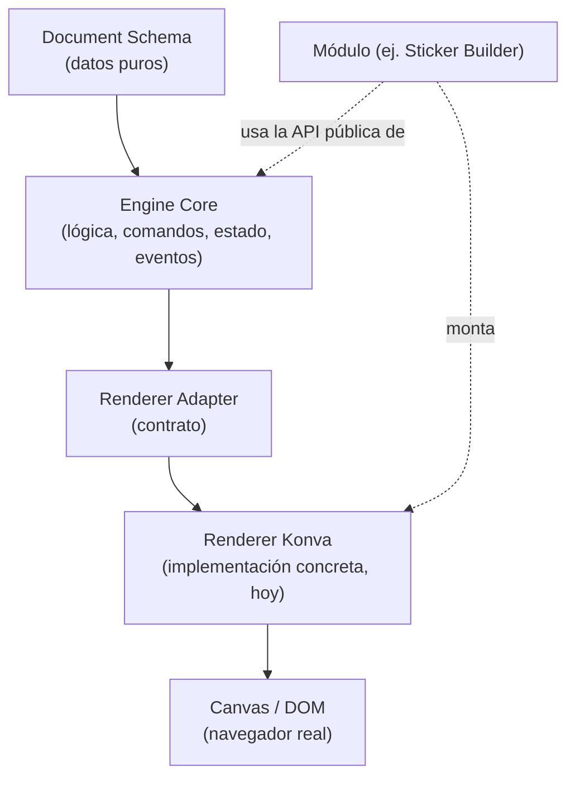

# 03 — Architecture Map

> Cómo está organizada toda la plataforma, en capas. Para el razonamiento de por qué se decidió así, ver [ADR-0001](../adr/0001-impulso-engine-architecture.md) y [`../ARCHITECTURE.md`](../ARCHITECTURE.md). Para el detalle de implementación de cada pieza, ver el README de su paquete.

---

## El mapa completo

```
                    ┌─────────────────────────────┐
                    │        Impulso Engine        │
                    │  (núcleo reutilizable)       │
                    │                               │
                    │  Document Schema              │
                    │       ↓                       │
                    │  Engine Core                   │
                    │       ↓                       │
                    │  Renderer Adapter (contrato)   │
                    └───────────────┬───────────────┘
                                    │
                                    ▼
                    ┌─────────────────────────────┐
                    │           Modules             │
                    │  (plugins sobre el Engine)    │
                    └───┬───────────┬───────────┬───┘
                        │           │           │
                        ▼           ▼           ▼
                ┌───────────┐ ┌───────────┐ ┌───────────────┐     ┌───────────────┐
                │  Sticker  │ │  Planner  │ │ Coloring Book │ ... │ Future Modules│
                │  Builder  │ │  Builder  │ │    Builder    │     │               │
                │ (✅ hoy)  │ │ (futuro)  │ │   (futuro)    │     │   (futuro)    │
                └───────────┘ └───────────┘ └───────────────┘     └───────────────┘
```

**Nota importante sobre esta forma:** Sticker Builder, Planner Builder, Coloring Book Builder y los módulos futuros **no dependen unos de otros** — son **hermanos**, cada uno un consumidor independiente del mismo Impulso Engine. La plataforma crece agregando módulos nuevos en paralelo, no encadenando uno sobre otro. (La instrucción original describe esta jerarquía como una cadena vertical de flechas; arquitectónicamente es un árbol — un núcleo con varias ramas — no una cadena, y ese es precisamente el punto: ningún módulo nuevo depende de que exista otro módulo antes que él.)

## Vista por capas técnicas (dentro de "Impulso Engine")



## Responsabilidades de cada capa

### Impulso Engine (el núcleo)

El núcleo se divide, a su vez, en tres piezas con dependencia estrictamente en una sola dirección — ninguna capa conoce a la que está después de ella:

| Capa | Paquete | Responsabilidad | Lo que NO hace |
|---|---|---|---|
| **Document Schema** | `packages/document-schema` | La única fuente de verdad de un proyecto: tipos (`Project → Document → Page → Layer → SceneObject`) + validación (Zod) + versionado/migraciones. Es literalmente lo que se guarda en disco o `localStorage`, y lo que viaja entre el Engine y cualquier Renderer. | No sabe dibujar nada. Cero dependencias de render, React, Canvas o DOM. |
| **Engine Core** | `packages/engine` | Opera exclusivamente sobre el Document Schema: comandos (agregar/mover/redimensionar/rotar/etc.), estado, undo/redo, selección (efímera), eventos. Toda la lógica de "qué le puedo hacer a un documento" vive aquí — incluida la matemática de resize/rotación. | No sabe dibujar nada, no conoce Konva ni ninguna librería de render, no sabe qué es un "sticker" ni una "línea de corte". |
| **Renderer Adapter** | `packages/renderer-konva` (primera implementación) | Traduce el Document Schema (vía Engine) a un árbol de nodos Konva reales, y traduce gestos de puntero (click, arrastre, handles) de vuelta en llamadas a `engine.dispatch(...)`. Es un adaptador reemplazable — el contrato que implementa (`RendererAdapter`) permitiría un `renderer-pixi` o `renderer-svg` sin tocar el Engine. | No decide ninguna regla de negocio: no valida, no versiona, no sabe qué pasa si un comando es inválido más allá de reflejarlo visualmente. |

### Modules (la capa de plugins)

Cada módulo (Sticker Builder, y en el futuro Planner Builder, Coloring Book Builder...) es un **consumidor** del Engine, no una extensión de él. Un módulo:

- Compone `createEngine()` + un `RendererAdapter` (hoy, `createKonvaRenderer()`) — exactamente como lo hace `apps/sticker-builder/src/bootstrap.ts`.
- Puede definir semántica propia usando `metadata.role` sobre los tipos genéricos del Document Schema (ej. la línea de corte de un sticker es un `path` con `role: "die-line"`) — nunca inventando un tipo de `SceneObject` nuevo.
- Construye su propia UI de aplicación (Toolbar, Sidebar, paneles de especificación de producto) — esto vive en la capa de aplicación, no en el Engine ni en el Renderer.
- Puede definir exportadores específicos de producto (ej. un PDF print-ready con línea de corte y sangrado para Sticker Builder) que leen el Document Schema directamente.

### Sticker Builder (el primer módulo, hoy construido)

`apps/sticker-builder` es la prueba de que la separación de capas funciona: un editor completo (Foundations 1-3, Editores 1-3, Editor Epic 1, Milestone 1 Alpha) construido componiendo únicamente las APIs públicas ya existentes del Engine y del Renderer, sin que ninguno de los dos supiera de antemano que "sticker" existía como concepto.

### Planner Builder / Coloring Book Builder / Future Modules (planeados, no construidos)

Módulos futuros que consumirían el mismo Impulso Engine de la misma manera que Sticker Builder — heredando selección, transformación, historial, resize/rotación y persistencia local sin reescribirlos. La validez de esta promesa (que un módulo nuevo no requiere tocar el núcleo) es, en sí misma, uno de los objetivos de producto declarados (ver [`01-Product-Vision.md`](01-Product-Vision.md), "Objetivos del producto").

## Qué hace posible este mapa

1. **Dirección única de dependencia** (ADR-0001): Document Schema no depende de nada; Engine depende solo de Document Schema; Renderer depende de Engine y de Document Schema; un Módulo depende de Engine y de un Renderer. Nunca al revés — verificado activamente con `madge --circular` en cada paquete del monorepo.
2. **Tipos genéricos, semántica vía metadata**: los 6 tipos de `SceneObject` (rectangle/ellipse/path/image/text/group) son los mismos para cualquier módulo — lo que hace único a un sticker, un planner o un coloring book se expresa con `metadata.role` y con exportadores/paneles propios del módulo, no con tipos de dato nuevos que fragmentarían el Document Schema entre módulos.
3. **El Renderer es reemplazable, no solo en teoría**: `packages/engine/package.json` no declara `konva` como dependencia — es una garantía verificable, no una promesa de diseño.
